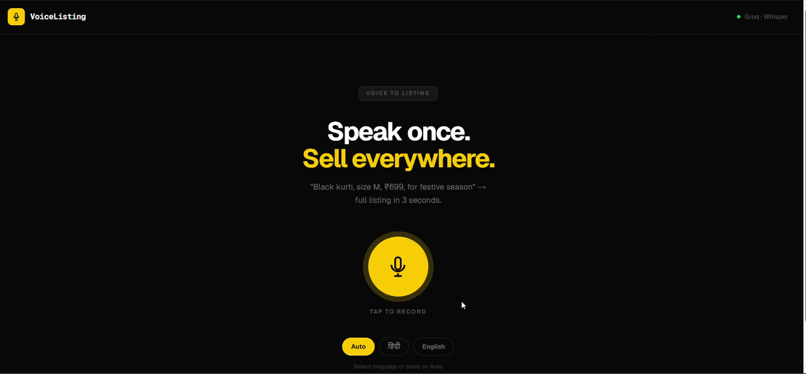
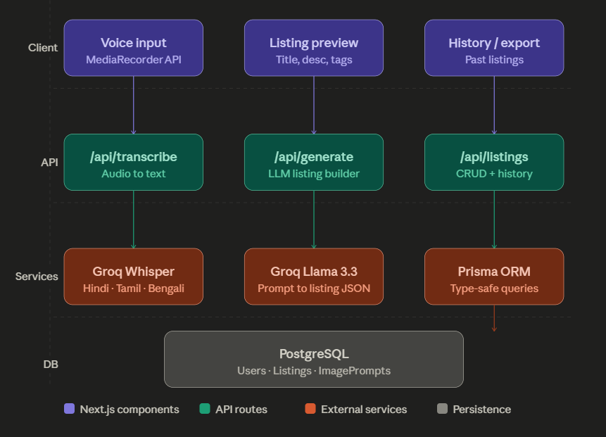

# VoiceListing

Voice-to-listing generator for Indian resellers — speak a product description in Hindi, Tamil, Bengali, or English and get a marketplace-ready listing in seconds.

## Demo



## Features

- **Multilingual voice input** — Whisper (via Groq) transcribes Hindi, Tamil, Bengali, and English audio
- **AI-generated listings** — Llama 3.3-70b extracts title, description, price, variant, occasion, and hashtags from raw speech
- **3 image prompts per listing** — ready to paste into any AI image generator
- **Persistent storage** — listings saved to PostgreSQL via Prisma with full relational schema
- **Language auto-detection** — no manual selection required; Whisper infers the language

## Tech Stack

| Tool                    | Why                                                                        |
| ----------------------- | -------------------------------------------------------------------------- |
| Next.js 15 (App Router) | API routes + React UI in one repo; no separate backend needed              |
| Groq (Whisper)          | Faster and cheaper than OpenAI's Whisper endpoint; generous free tier      |
| Groq (Llama 3.3-70b)    | Free tier covers development; structured JSON output via `response_format` |
| PostgreSQL + Prisma     | Typed DB queries; schema changes via migrations, not raw SQL               |
| Tailwind CSS v4         | No config file; utility-first keeps the component code readable            |

## Architecture



## Getting Started

```bash
git clone https://github.com/ajay-thakare/voice-listing.git
cd voice-listing
npm install

# Run database migrations
npx prisma migrate dev

# Start the dev server
npm run dev
```

Open [http://localhost:3000](http://localhost:3000).

## Environment Variables

```env
# PostgreSQL connection string
DATABASE_URL=

# Groq API key — used for both Whisper transcription and Llama generation

# Get one free at https://console.groq.com
GROQ_API_KEY=
```

## What I'd Add Next

- **Listing history page** — `/dashboard/history` pulling from the existing `GET /api/listings` endpoint; the DB schema already supports it
- **Image generation** — pipe the 3 image prompts directly into a free model (SDXL via Replicate) so resellers get actual photos, not just prompts
- **WhatsApp export** — one-tap share button that formats the listing into a WhatsApp-ready message; the primary sharing channel for Meesho resellers
